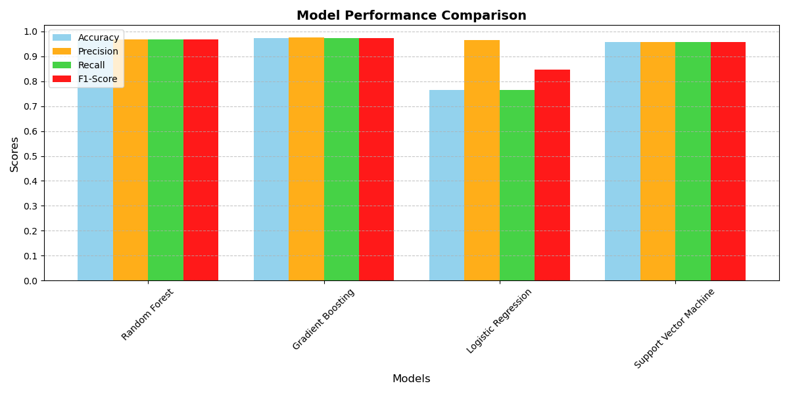
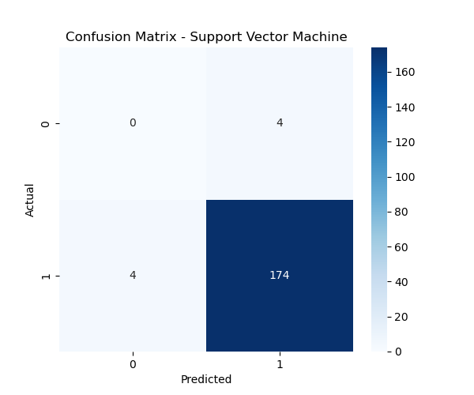
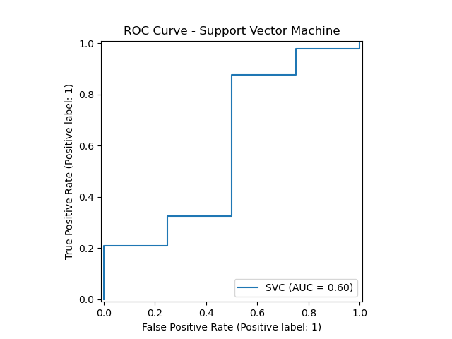

# AI-Based Cyber Threat Detection System

This project implements a multi-model machine learning framework for detecting cyber threats in network traffic data.

## 🚀 Key Features
- Logistic Regression
- Random Forest
- Gradient Boosting
- Support Vector Machine
- ROC Curves and Confusion Matrices
- Feature Importance Analysis

## 📊 Results

### Model Performance Comparison

### Feature Importance

### Confusion Matrix (Random Forest)

### ROC Curve (Random Forest)

## ⚙️ Tech Stack
- Python
- Scikit-learn
- Pandas, NumPy
- Matplotlib

## 📄 Research Paper
See the full research paper in the `paper/` folder.
